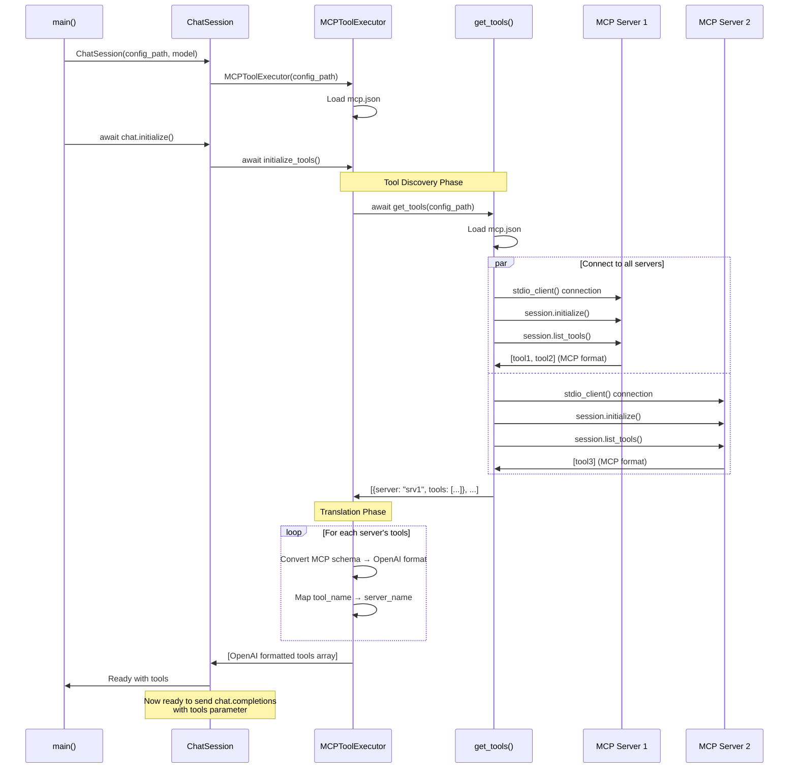
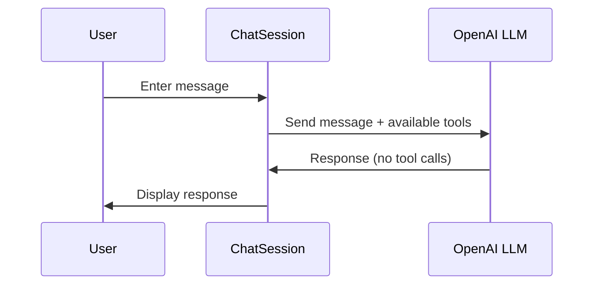
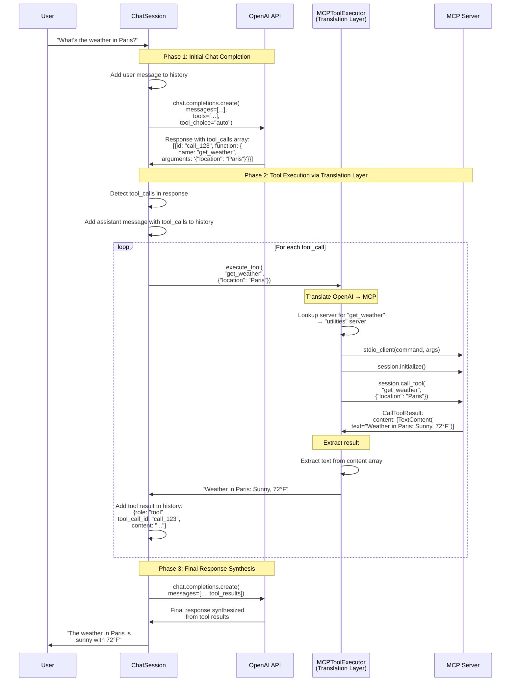
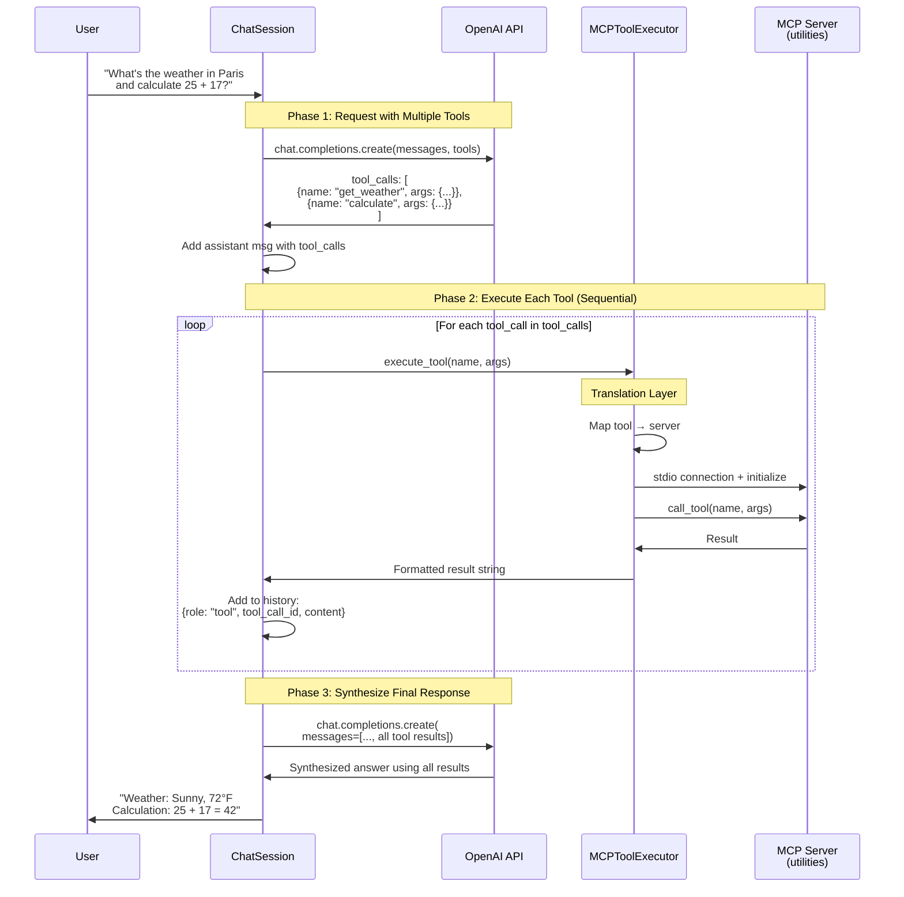

# Chat with Tools Agent Documentation

## Overview

`chatwithtools.py` demonstrates how to integrate MCP (Model Context Protocol) into a "tools with chat" application. It shows a clean architectural pattern with two key components:

1. **ChatSession** - Orchestrates the chat completions workflow, using the `get_tools()` function to format MCP tools for OpenAI's function calling API
2. **MCPToolExecutor** - Acts as a translation layer, converting OpenAI tool call responses into MCP server calls and completing the tool execution sequence

This pattern enables an OpenAI LLM to dynamically discover and call tools hosted on any MCP server without hardcoding tool definitions.

## Architecture

The system consists of four main participants:

1. **User** - Interacts via command-line interface
2. **ChatSession** - Orchestrates conversation flow and OpenAI API communication
3. **MCPToolExecutor** - Translates between OpenAI tool calls and MCP server protocol
4. **MCP Servers** - External processes providing tools via stdio (e.g., weather, calculator)

## Component Description

### ChatSession Class

The `ChatSession` class implements the "tools with chat" pattern, orchestrating the complete conversation flow with OpenAI:

**Responsibilities:**
- **Chat Orchestration**: Manages conversation history and sends requests to OpenAI with tools array
- **Tool Array Preparation**: Calls `MCPToolExecutor.initialize_tools()` to get MCP tools formatted for OpenAI
- **Tool Call Detection**: Monitors OpenAI responses for `tool_calls` array
- **Tool Execution Coordination**: Delegates tool execution to MCPToolExecutor and adds results to conversation
- **Response Synthesis**: Sends tool results back to OpenAI for final response generation

**Key Methods:**
- `initialize()` - Loads MCP tools via `tool_executor.initialize_tools()` for the tools array
- `send_message(user_message)` - Orchestrates the full chat completion cycle including tool calls
- `run()` - Interactive command-line loop

**Key Pattern:**
```python
# Phase 1: Chat with tools array
response = openai.chat.completions.create(
    model=self.model,
    messages=self.messages,
    tools=self.tools,  # Formatted by MCPToolExecutor
    tool_choice="auto"
)

# Phase 2: Execute tools if requested
if response.tool_calls:
    for tool_call in response.tool_calls:
        result = await tool_executor.execute_tool(...)
        # Add result to messages

    # Phase 3: Get final response with tool results
    response = openai.chat.completions.create(...)
```

### MCPToolExecutor Class

The `MCPToolExecutor` class acts as a **translation layer** between OpenAI's function calling format and MCP's protocol:

**Responsibilities:**
- **Tool Discovery**: Uses `get_tools()` from `get_mcp_tools.py` to fetch tools from all MCP servers
- **Format Translation**: Converts MCP tool schemas to OpenAI function calling format
- **Tool Routing**: Maps tool names to their source MCP servers
- **Call Translation**: Translates OpenAI tool call format into MCP `call_tool` requests
- **Connection Management**: Establishes stdio connections to MCP servers for each tool execution

**Key Methods:**
- `initialize_tools()` - Calls `get_tools(config_path)` and transforms schemas to OpenAI format
- `execute_tool(tool_name, arguments)` - Translates and executes tool call on appropriate MCP server

**Translation Process:**
```python
# MCP Format (from server)
{
    "name": "get_weather",
    "description": "Get weather for location",
    "inputSchema": { "type": "object", "properties": {...} }
}

# OpenAI Format (for chat completions)
{
    "type": "function",
    "function": {
        "name": "get_weather",
        "description": "Get weather for location",
        "parameters": { "type": "object", "properties": {...} }
    }
}
```

### get_tools() Function (from get_mcp_tools.py)

Utility function used by MCPToolExecutor during initialization:

**Responsibilities:**
- Loads `mcp.json` configuration
- Connects to each MCP server via stdio
- Calls `session.list_tools()` to retrieve tool definitions
- Returns array of tools with their schemas in MCP format

**Returns:**
```python
[
    {
        "server": "utilities",
        "tools": [
            {
                "name": "get_weather",
                "description": "...",
                "inputSchema": {...}
            }
        ],
        "tool_count": 2
    }
]
```

### Configuration

The system uses an `mcp.json` configuration file that defines MCP servers:

```json
{
  "mcpServers": {
    "utilities": {
      "command": "python3",
      "args": ["server.py"],
      "env": {}
    }
  }
}
```

## Interaction Flow

### Initialization Sequence

This diagram shows how MCP tools are discovered and formatted for OpenAI during startup:



### Standard Message Flow (No Tools)



### Tool-Assisted Message Flow

This diagram shows the complete sequence when OpenAI requests tool execution:



### Multi-Tool Flow

This diagram shows how multiple tool calls are handled in parallel:



## Detailed Workflow

### 1. Initialization Phase

The initialization establishes the translation layer between MCP and OpenAI:

1. **ChatSession** creates **MCPToolExecutor** with config path
2. MCPToolExecutor loads `mcp.json` configuration
3. ChatSession calls `await tool_executor.initialize_tools()`
4. **MCPToolExecutor.initialize_tools()** process:
   - Calls `get_tools(config_path)` from `get_mcp_tools.py`
   - `get_tools()` connects to each MCP server via stdio
   - Each server responds with tools in **MCP format** (name, description, inputSchema)
   - **Translation**: MCPToolExecutor converts each tool from MCP format to **OpenAI function format**
   - Creates `tool_to_server` mapping for routing tool calls
   - Returns array of tools formatted for OpenAI's `tools` parameter
5. ChatSession stores formatted tools array for all subsequent chat requests

### 2. Chat Loop (Tools with Chat Pattern)

1. User enters a message
2. ChatSession adds message to conversation history
3. ChatSession sends request to OpenAI:
   ```python
   response = openai.chat.completions.create(
       model=self.model,
       messages=self.messages,          # Conversation history
       tools=self.tools,                 # MCP tools in OpenAI format
       tool_choice="auto"                # LLM decides when to use
   )
   ```

### 3. Response Handling

#### Path A: No Tool Calls
- OpenAI responds directly with text (no `tool_calls` in response)
- ChatSession adds assistant message to history
- Response displayed to user
- Loop continues

#### Path B: Tool Calls Required (Translation Workflow)

**Phase 1: Tool Call Detection**
- OpenAI response includes `tool_calls` array
- Each call contains: `id`, `function.name`, `function.arguments` (JSON string)
- ChatSession adds assistant message with tool_calls to conversation history

**Phase 2: Tool Execution via Translation Layer**
For each tool call in the array:
1. **ChatSession → MCPToolExecutor**
   - Calls `execute_tool(tool_name, arguments)`
   - Passes tool name and parsed arguments dict

2. **MCPToolExecutor Translation**
   - Looks up server name from `tool_to_server` mapping
   - Retrieves server config (command, args, env) from loaded config
   - Creates `StdioServerParameters` for the target server

3. **MCP Connection & Execution**
   - Establishes stdio connection to MCP server
   - Initializes MCP session
   - Calls `session.call_tool(tool_name, arguments)` in **MCP protocol**
   - Receives `CallToolResult` with content array

4. **Result Extraction**
   - Extracts text from result.content array
   - Returns formatted string to ChatSession

5. **Add to Conversation**
   - ChatSession adds tool result to history:
     ```python
     {
         "role": "tool",
         "tool_call_id": tool_call.id,
         "content": tool_result_string
     }
     ```

**Phase 3: Response Synthesis**
1. ChatSession sends new request to OpenAI with updated message history (including tool results)
2. OpenAI synthesizes final response incorporating tool results
3. ChatSession adds final response to history and displays to user

## Key Design Patterns

### 1. Translation Layer Pattern

**MCPToolExecutor** acts as a protocol translator between OpenAI and MCP:

**During Initialization:**
```python
# MCP → OpenAI Format Translation
MCP: {"name": "x", "inputSchema": {...}}
  ↓
OpenAI: {"type": "function", "function": {"name": "x", "parameters": {...}}}
```

**During Execution:**
```python
# OpenAI → MCP Call Translation
OpenAI: tool_call.function.name, tool_call.function.arguments
  ↓
MCP: session.call_tool(name, arguments)
```

This allows MCP servers to be used with any LLM API that supports function calling.

### 2. Tools with Chat Pattern

**ChatSession** demonstrates the standard "tools with chat" workflow:

```python
# Pattern: Discovery → Format → Call → Translate → Execute → Respond
async def initialize():
    # Get MCP tools formatted for OpenAI
    self.tools = await tool_executor.initialize_tools()

async def send_message(user_message):
    # Send with tools parameter
    response = openai.chat.completions.create(tools=self.tools, ...)

    # If tool calls requested, execute via translation layer
    if response.tool_calls:
        for tool_call in response.tool_calls:
            result = await tool_executor.execute_tool(...)
            # Add to conversation

        # Get final response with tool results
        response = openai.chat.completions.create(...)
```

### 3. Automatic Tool Discovery

The system dynamically discovers all tools from configured MCP servers using `get_tools()`:

- No hardcoded tool definitions
- Supports any number of MCP servers
- Tools are discovered at runtime during initialization
- New tools automatically available when servers are updated

```python
# All tools fetched dynamically via get_tools()
server_tools = await get_tools(config_path)
# Then translated to OpenAI format
```

### 4. Multi-Server Tool Routing

MCPToolExecutor maintains a routing map to execute tools on the correct server:

```python
# Built during initialization
self.tool_to_server = {
    "get_weather": "utilities",
    "calculate": "utilities",
    "other_tool": "different_server"
}

# Used during execution
server_name = self.tool_to_server.get(tool_name)
```

### 5. Stateless Tool Execution

Each tool call creates a fresh stdio connection to the MCP server:
- No persistent connections
- Each execution is isolated
- Simpler error handling
- Works with stdio transport model

### 6. Error Handling

- Missing servers or tools return error messages
- Failed tool executions are caught and reported
- Conversation continues even if tools fail
- Errors formatted as tool results for OpenAI to handle

### 7. Conversation Context Preservation

Full conversation history maintained across tool calls:
- All messages stored in `self.messages` array
- Tool calls added as assistant messages
- Tool results added as tool role messages
- Enables multi-turn conversations with tools

## Architectural Summary

### The Integration Pattern

This example demonstrates a **clean separation of concerns** for integrating MCP into chat applications:

```
┌─────────────────────────────────────────────────────────────┐
│                        ChatSession                          │
│  • Orchestrates chat completions                            │
│  • Manages conversation flow                                │
│  • Detects tool calls in responses                          │
└────────────────┬────────────────────────────────────────────┘
                 │ uses
                 ↓
┌─────────────────────────────────────────────────────────────┐
│                    MCPToolExecutor                          │
│  • Translation Layer between OpenAI ↔ MCP                   │
│  • Uses get_tools() to fetch MCP tool schemas               │
│  • Converts schemas: MCP format → OpenAI format             │
│  • Translates calls: OpenAI tool_calls → MCP call_tool     │
│  • Routes tools to correct servers                          │
└────────────────┬────────────────────────────────────────────┘
                 │ uses
                 ↓
┌─────────────────────────────────────────────────────────────┐
│              get_tools() (get_mcp_tools.py)                 │
│  • Connects to all configured MCP servers                   │
│  • Retrieves tool definitions via session.list_tools()     │
│  • Returns tools in MCP format                              │
└─────────────────────────────────────────────────────────────┘
```

### Why This Pattern Matters

1. **Reusability**: MCPToolExecutor can be reused in any OpenAI chat application
2. **Extensibility**: Works with any MCP server without code changes
3. **Maintainability**: Clear separation between chat logic and MCP integration
4. **Portability**: The translation layer pattern works with other LLM APIs (Anthropic, etc.)

### Key Takeaway

The example shows that integrating MCP into a "tools with chat" application requires:
1. A **formatting component** (`get_tools()`) to fetch tool schemas
2. A **translation component** (MCPToolExecutor) to convert between formats
3. A **orchestration component** (ChatSession) to manage the chat flow

This three-layer architecture cleanly separates MCP protocol details from application logic.

## Usage

### Basic Usage

```bash
export OPENAI_API_KEY="your-api-key"
python chatwithtools.py mcp.json
```

### With Custom Model

```bash
python chatwithtools.py mcp.json gpt-4o
```

### Example Interaction

```
Chat session started. Type 'exit' or 'quit' to end the session.
============================================================

You: help me find the product of 5 and 6
Calling tool: calculate with args: {'operator': 'multiply', 'argument1': '5', 'argument2': '6'}
[01/04/26 15:13:19] INFO     Processing request of type CallToolRequest                                                                            server.py:558

Assistant: The product of 5 and 6 is 30.

You: what is the weather in Paris
Calling tool: get_weather with args: {'location': 'Paris'}
[01/04/26 15:13:31] INFO     Processing request of type CallToolRequest                                                                            server.py:558

Assistant: The weather in Paris is sunny with a temperature of 72°F.

You: exit
Goodbye!
```