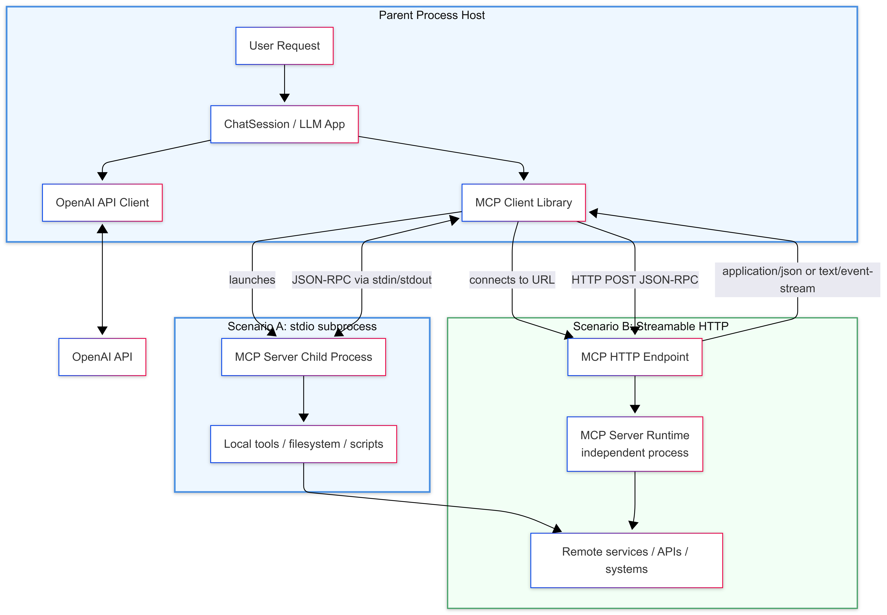
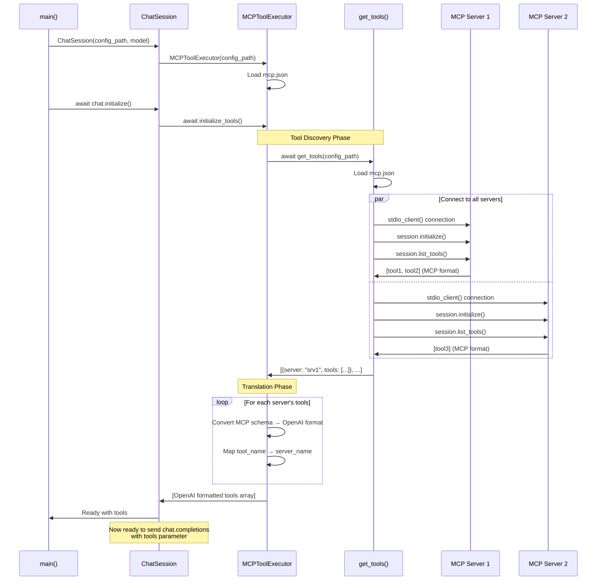
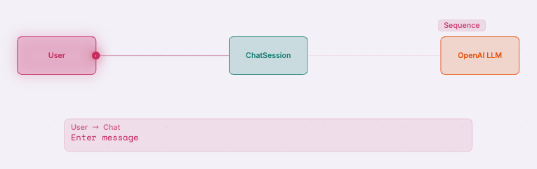
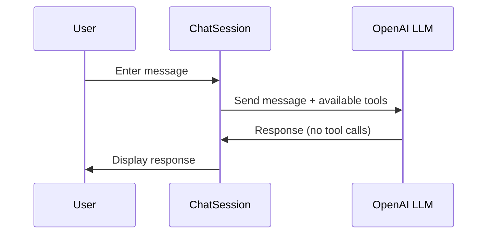
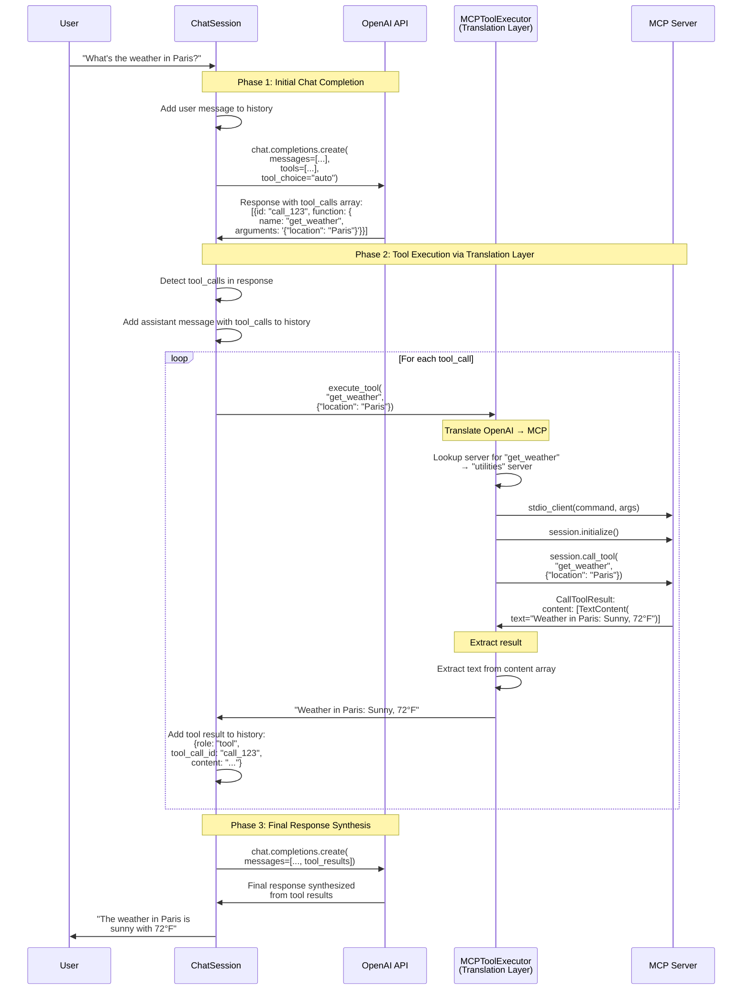
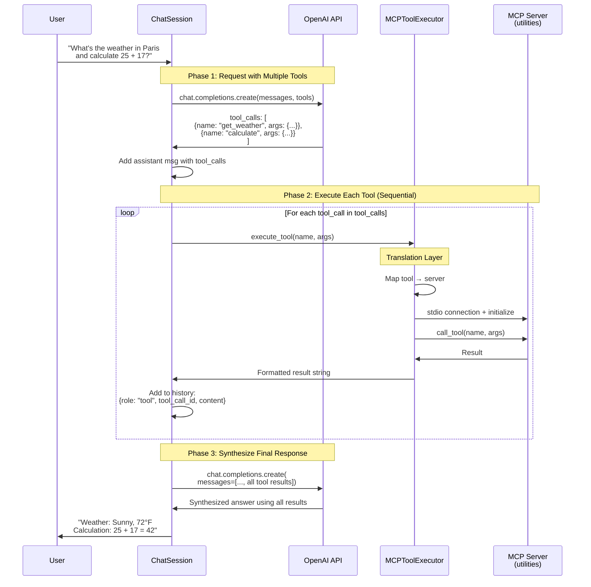

# MCP Course

A learning project demonstrating how to integrate the Model Context Protocol (MCP) into chat applications. This repository shows practical patterns for connecting OpenAI's LLM with MCP servers to enable dynamic tool discovery and execution.

## Overview

This project demonstrates how to integrate MCP servers so they can be called as tools in an application using OpenAI-compatible API calls that take an array of tool definitions.

The architecture shows how to cleanly separate concerns when integrating MCP into LLM applications, making it easy to add new tools without modifying application code.

## Features

- **Dynamic Tool Discovery**: Automatically discovers all tools from configured MCP servers at runtime
- **Multi-Server Support**: Connect to multiple MCP servers simultaneously
- **Format Translation**: Seamlessly converts between MCP and OpenAI function calling formats
- **Interactive Chat**: Example application that implements conversation context with multi-turn tool usage

## Prerequisites

- Python 3.12 or higher
- OpenAI API key
- `uv` package manager (recommended) or `pip`

## Installation

### Using uv 

```bash
# Install dependencies
uv sync
```

## Running the Examples

### 1. Interactive Chat with MCP Tools

The main example demonstrating the "tools with chat" pattern:

```bash
# Set your OpenAI API key (also supports .env)
export OPENAI_API_KEY="your-api-key-here"
# Optional set alternative API base URL
export OPENAI_BASE_URL="your-alt-url/v1 here"

# Run with default model (gpt-4o-mini)
python chatwithtools.py mcp.json

# Or specify a different model
python chatwithtools.py mcp.json gpt-4o
```

# Architecture

## MCP Architecture Overview



## Course Application Architecture

`chatwithtools.py` demonstrates how to integrate MCP (Model Context Protocol) into a "tools with chat" application. It shows a clean architectural pattern with two key components:

1. **ChatSession** - Orchestrates the chat completions workflow, using the `get_tools()` function to format MCP tools for OpenAI's function calling API
2. **MCPToolExecutor** - Acts as a translation layer, converting OpenAI tool call responses into MCP server calls and completing the tool execution sequence

This pattern enables an OpenAI LLM to dynamically discover and call tools hosted on any MCP server without hardcoding tool definitions.
The system consists of four main participants:

1. **User** - Interacts via command-line interface
2. **ChatSession** - Orchestrates conversation flow and OpenAI API communication
3. **MCPToolExecutor** - Translates between OpenAI tool calls and MCP server protocol
4. **MCP Servers** - External processes providing tools via stdio (e.g., weather, calculator)

## Component Description

### ChatSession Class

The `ChatSession` class implements the "tools with chat" pattern, orchestrating the complete conversation flow with OpenAI:

**Responsibilities:**
- **Chat Orchestration**: Manages conversation history and sends requests to OpenAI with tools array
- **Tool Array Preparation**: Calls `MCPToolExecutor.initialize_tools()` to get MCP tools formatted for OpenAI
- **Tool Call Detection**: Monitors OpenAI responses for `tool_calls` array
- **Tool Execution Coordination**: Delegates tool execution to MCPToolExecutor and adds results to conversation
- **Response Synthesis**: Sends tool results back to OpenAI for final response generation

**Key Methods:**
- `initialize()` - Loads MCP tools via `tool_executor.initialize_tools()` for the tools array
- `send_message(user_message)` - Orchestrates the full chat completion cycle including tool calls
- `run()` - Interactive command-line loop

**Key Pattern:**
```python
# Phase 1: Chat with tools array
response = openai.chat.completions.create(
    model=self.model,
    messages=self.messages,
    tools=self.tools,  # Formatted by MCPToolExecutor
    tool_choice="auto"
)

# Phase 2: Execute tools if requested
if response.tool_calls:
    for tool_call in response.tool_calls:
        result = await tool_executor.execute_tool(...)
        # Add result to messages

    # Phase 3: Get final response with tool results
    response = openai.chat.completions.create(...)
```

### MCPToolExecutor Class

The `MCPToolExecutor` class acts as a **translation layer** between OpenAI's function calling format and MCP's protocol:

**Responsibilities:**
- **Tool Discovery**: Uses `get_tools()` from `get_mcp_tools.py` to fetch tools from all MCP servers
- **Format Translation**: Converts MCP tool schemas to OpenAI function calling format
- **Tool Routing**: Maps tool names to their source MCP servers
- **Call Translation**: Translates OpenAI tool call format into MCP `call_tool` requests
- **Connection Management**: Establishes stdio connections to MCP servers for each tool execution

**Key Methods:**
- `initialize_tools()` - Calls `get_tools(config_path)` and transforms schemas to OpenAI format
- `execute_tool(tool_name, arguments)` - Translates and executes tool call on appropriate MCP server

**Translation Process:**
```python
# MCP Format (from server)
{
    "name": "get_weather",
    "description": "Get weather for location",
    "inputSchema": { "type": "object", "properties": {...} }
}

# OpenAI Format (for chat completions)
{
    "type": "function",
    "function": {
        "name": "get_weather",
        "description": "Get weather for location",
        "parameters": { "type": "object", "properties": {...} }
    }
}
```

### get_tools() Function (from get_mcp_tools.py)

Utility function used by MCPToolExecutor during initialization:

**Responsibilities:**
- Loads `mcp.json` configuration
- Connects to each MCP server via stdio
- Calls `session.list_tools()` to retrieve tool definitions
- Returns array of tools with their schemas in MCP format

**Returns:**
```python
[
    {
        "server": "utilities",
        "tools": [
            {
                "name": "get_weather",
                "description": "...",
                "inputSchema": {...}
            }
        ],
        "tool_count": 2
    }
]
```

### Configuration

The system uses an `mcp.json` configuration file that defines MCP servers:

```json
{
  "mcpServers": {
    "utilities": {
      "command": "python3",
      "args": ["server.py"],
      "env": {}
    }
  }
}
```

## Interaction Flow

### Initialization Sequence

This diagram shows how MCP tools are discovered and formatted for OpenAI during startup:




### Standard Message Flow (No Tools)





### Tool-Assisted Message Flow

This diagram shows the complete sequence when OpenAI requests tool execution:




### Multi-Tool Sequential Flow

This diagram shows how multiple tool calls are handled sequentially:



# Usage

### Basic Usage

```bash
export OPENAI_API_KEY="your-api-key"
python chatwithtools.py mcp.json
```

### With Custom Model

```bash
python chatwithtools.py mcp.json gpt-4o
```

### Example Interaction

```
Chat session started. Type 'exit' or 'quit' to end the session.
============================================================

You: help me find the product of 5 and 6
Calling tool: calculate with args: {'operator': 'multiply', 'argument1': '5', 'argument2': '6'}
[01/04/26 15:13:19] INFO     Processing request of type CallToolRequest                                                                            server.py:558

Assistant: The product of 5 and 6 is 30.

You: what is the weather in Paris
Calling tool: get_weather with args: {'location': 'Paris'}
[01/04/26 15:13:31] INFO     Processing request of type CallToolRequest                                                                            server.py:558

Assistant: The weather in Paris is sunny with a temperature of 72°F.

You: exit
Goodbye!
```